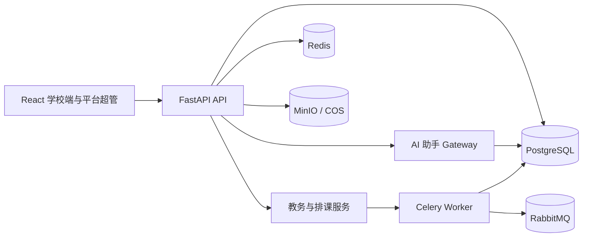

# 轻课堂 / Light Classroom

An intelligent academic administration platform for senior high schools.

- [中文](README.zh.md)
- [English](README.en.md)

轻课堂将学校组织、人员、班级、学生、课程、排课、文件和 AI 教务助手整合到一个系统中，面向普通高中日常教务管理场景。

## 核心能力

- 多租户学校管理：平台超管开通学校，学校端独立登录，请求通过 `X-School-Code` 隔离数据
- 教师档案、学生、班级、科目、课时和任教关系管理
- 基于 OR-Tools CP-SAT 的规则化自动排课
- 新高考 3+1+2 走班：学生端选科、教学班生成、师资/教室资源校验和走班课表
- 排课规则工作台、课表预览、调课和异步生成任务
- 文件中心，支持 MinIO 或腾讯云 COS
- AI 教务助手：页面上下文、只读教务工具、可恢复运行、流式进度和确认式变更方案
- 会话历史与结构化长期记忆 MVP
- 可选 Prometheus 指标和 Grafana 监控

## 系统架构



PostgreSQL 保存业务数据、会话历史、结构化助手记忆和任务状态；Redis 用于运行时协调与限流；RabbitMQ 和 Celery 负责长时间运行的排课与教务任务。前端使用同一套 React/Vite 应用承载学校端和平台超管入口。

## 技术栈

| 层 | 技术 |
| --- | --- |
| 前端 | React 19 · TypeScript · Vite · Ant Design · TanStack Query |
| 后端 | Python 3.11+ · FastAPI · SQLModel · SQLAlchemy |
| 数据 | PostgreSQL · Redis · RabbitMQ · MinIO |
| 排课 | OR-Tools CP-SAT |
| AI | OpenAI 兼容模型服务、Tool Calling、本地意图与知识模块 |
| 监控 | Prometheus / Grafana（可选） |

## 仓库结构

```text
frontend-react/   React 学校端和平台超管应用
backend/          API、领域服务、迁移、Worker 和测试
docs/             架构、配置、部署、运维和规格文档
db/               数据库说明和本地 SQL 工具
monitoring/       Prometheus / Grafana 配置
scripts/          Windows 开发和重启脚本
```

## 快速开始

Windows 开发环境可以直接执行：

```powershell
.\scripts\restart-dev.ps1
```

它会启动后端 `8001`、Celery Worker（`scheduling` / `academic` 队列）和前端 `5176`。

手动启动后端：

```bash
cd backend
cp .env.example .env
# 至少设置 JWT_SECRET_KEY，并配置本地服务连接信息
pip install -e ".[dev]"
pip install ortools
docker compose up -d postgres redis rabbitmq minio
uvicorn app.main:app --reload --port 8001
```

另开终端启动前端：

```bash
cd frontend-react
pnpm install
pnpm dev -- --port 5176
```

本地入口：

| 服务 | 地址 |
| --- | --- |
| 学校教务后台 | http://127.0.0.1:5176/login |
| 平台超管后台 | http://127.0.0.1:5176/admin/login |
| 学生选科登录 | http://127.0.0.1:5176/student/login |
| API | http://127.0.0.1:8001 |
| OpenAPI 文档 | http://127.0.0.1:8001/docs |
| 健康检查 | http://127.0.0.1:8001/health |

打开 `http://127.0.0.1:5176` 会进入前端应用；学校教务人员使用 `/login` 登录，平台超管使用 `/admin/login` 登录。开发超管账号由 `backend/.env` 中的 `ADMIN_USERNAME` 和 `ADMIN_PASSWORD` 配置，部署前必须修改示例口令。

学生使用学校代码、学号和学生端初始密码登录 `/student/login`。教务人员进入“学生档案”，点击“开通学生登录”，按年级批量生成学生账号；账号开通后，学生在“我的高考选科”页面保存草稿或提交选科。学生端与教职工账号体系隔离。

开发环境 `APP_ENV=dev` 时可以自动建表并写入内置角色。生产环境请按 [`docs/deploy.md`](docs/deploy.md) 执行迁移和部署。

## AI 助手

AI 助手通过 `/api/v1/assistant` 提供服务，主要面向教务操作。它能够接收当前页面和学校上下文，调用只读教务工具，流式报告可恢复任务进度；涉及排课数据变更时，先生成需要人工确认的操作方案。

短期会话保存在 `ai_conversation`，结构化长期记忆保存在 `ai_memory`。长期记忆 MVP 当前用于保存用户偏好和高优先级约束，并在后续助手运行中注入相关上下文。

## 测试

```bash
cd backend
pytest
```

完整排课测试较重，开发时可以先运行认证、RBAC、助手和规则引擎相关测试。

## 数据与安全

不要提交包含学生信息、密码哈希、Token 或本地环境变量的 SQL 文件和配置文件。安全问题请参考 [`SECURITY.md`](SECURITY.md)，数据库说明见 [`db/README-sql.md`](db/README-sql.md)。

## 文档

- [架构](docs/architecture.md)
- [配置](docs/config.md)
- [部署](docs/deploy.md)
- [运维](docs/ops.md)
- [前端页面](docs/frontend.md)
- [数据库 ER 图](docs/ER-diagram.md)
- [排课规格](docs/specs/schedule-and-seating.md)
- [新高考走班规格与操作流程](docs/specs/new-gaokao-walk-class.md)
- [贡献指南](CONTRIBUTING.md)

## 许可证

本项目原创代码采用[轻课堂非商业许可证](LICENSE)：允许个人、教育、研究和其他非商业使用；商业部署、商业托管、销售或集成到商业产品，需要事先取得版权持有者的书面授权。第三方依赖和资源遵循各自许可证。
