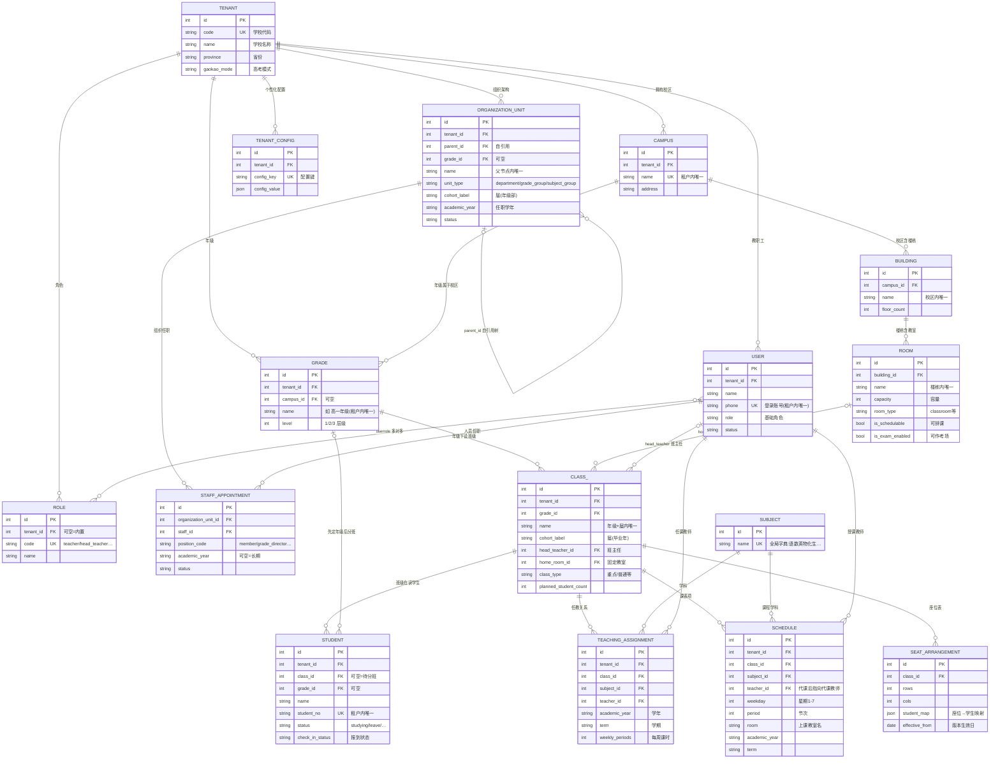

# 轻课堂 · 核心 ER 关系图

> 覆盖组织架构 / 班级学生 / 排课任教 / 权限配置四大核心域(20 张表,全库共 63 张)。
> 实线 = 数据库外键;虚线 = 逻辑关联(未建 FK,应用层维护)。
> 所有业务表均含 `tenant_id`(多租户隔离),图上省略该字段以聚焦业务关系。

## 阅读指引

- **多租户**:所有业务表带 `tenant_id`,名称类唯一约束均为「租户内唯一」(class 是 租户+年级+届+班名)
- **届(cohort)**:`class.cohort_label` 存毕业年(如 2029);`organization_unit` 的年级部同款字段,两者对齐
- **组织树**:`organization_unit.parent_id` 自引用;「年级管理中心 → 年级部」靠 unit_type=`grade_group` + 标记识别;教师学科资质来自 `subject_group` 单元的任职
- **排课三键**:`teaching_assignment`(谁教哪个班哪科)→ `schedule`(具体排到周几第几节);`schedule.teacher_id` 可被"代课"功能改写,不改任教关系
- **软关联**:`class.head_teacher_id`、`class.home_room_id` 等为逻辑关联,数据库未建强外键,由应用层维护一致性
