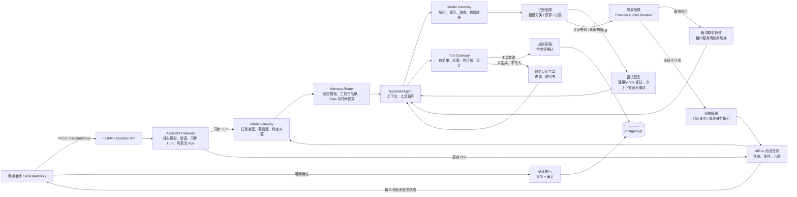
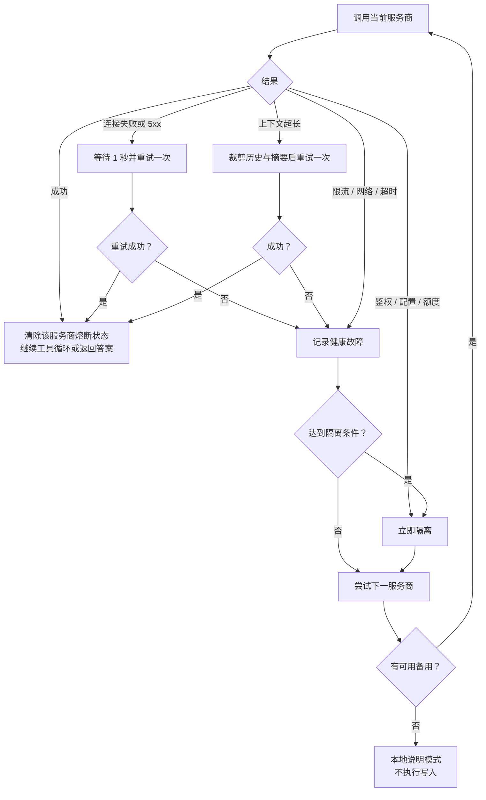

# 教务助手健壮性架构

本文记录轻课堂教务助手在模型调用、工具调用和后台任务上的故障处理边界。目标不是让调用永远不失败，而是在失败时让老师知道系统正在做什么，并确保没有确认过的业务写入不会被自动重放。

## 架构图（文本）



主链路可用下面的文本快速阅读：

```text
老师提问
  -> FastAPI 完成登录、学校和权限校验
  -> Assistant Gateway 投影模型可见上下文，并选择同步 Turn 或持久化 AiRun
  -> Intent Gateway 根据本轮话语、当前页面和近期上下文输出结构化意图、置信度和判定来源
  -> Harness Router 只按结构化意图选择页面说明、准备检查、故障诊断或规则配置
  -> 后台任务模式下，页面持续读取状态、阶段和心跳
  -> Assistant Agent 通过 Model Gateway 读取并调用模型
  -> Tool Gateway 按本轮租户、用户和权限开放教务工具
  -> 主模型 + 教务工具循环
       ├─ 成功：回答 / 生成待确认草稿
       ├─ 可恢复错误：重试或压缩上下文后重试
       ├─ 服务商故障：熔断并切备用模型
       └─ 所有模型不可用：返回本地教务说明，绝不自动写入
  -> 老师核对草稿并明确确认
  -> 单事务保存规则和审计回执
```

## 固定 Harness 路由

当前采用受约束的 JIT 思路：`IntentGateway` 负责识别老师要说明页面、核对准备、诊断故障还是配置规则，并产生 `IntentDecision`；`HarnessRouter` 不再读取自然语言，只把 `AssistantIntent` 枚举映射到服务端注册并经过测试的 Harness。两步分别以 `intent.classified` 和 `harness.selected` 记录在 `AiRun.events` 的内部诊断轨迹中。

当前识别器用本地 `bge-base-zh-v1.5` 生成查询向量，在 PostgreSQL `pgvector` 中检索经过审核的意图样例，并用相似度与领先差值决定是否采用结果。低置信度或向量服务不可用时安全回落到 `guide`。意图结果只选择任务策略，不能授予权限，也不能执行模型生成的 Python、SQL 或 Shell。

意图向量初始化顺序：先为 PostgreSQL 服务器安装 `pgvector`，执行 `alembic upgrade head`，配置 `ASSISTANT_EMBEDDING_MODEL_PATH`，最后在 `backend` 目录运行 `python -m scripts.seed_assistant_intents`。意图样例可以持续扩充；后续文档 RAG 复用同一个 BGE 生成服务和 PostgreSQL 向量扩展，但使用独立的租户隔离文档表。

| Harness | 策略 | 能力范围 | 预算 |
|---|---|---|---|
| `guide` | 直接回答或短 ReAct | 页面说明和通用只读查询 | 最多 3 Step / 90 秒 |
| `readiness` | 清单式 ReAct | 学年学期、课时课位、任教、规则只读核对 | 最多 5 Step / 150 秒 |
| `diagnosis` | 证据优先 ReAct | 排课任务状态、准备数据、任教和规则只读查询 | 最多 6 Step / 180 秒 |
| `configuration` | 草稿式 ReAct | 查询现状并生成规则草稿；保存仍需独立人工确认 | 最多 5 Step / 150 秒 |

Harness 的 `allowed_tools` 只会进一步缩小账号原有权限，不会授予新权限。最终可调用工具是“账号权限、Harness 白名单、Tool Gateway 服务端白名单”的交集。

## 四层防线与当前实现

| 防线 | 当前行为 | 代码位置 | 对老师可见的结果 |
|---|---|---|---|
| 识别 Detect | 对 HTTP 状态、网络、限流、鉴权、额度、配置、上下文超长和响应解析分类；运行任务记录阶段与心跳 | `backend/app/ai/gateway/model.py`、`backend/app/ai/model/chat.py`、`backend/app/ai/runs/service.py` | “正在检查模型服务和备用通道”、具体失败提示或任务中断提示 |
| 恢复 Recover | 连接失败和 500/502/503/504 等待 1 秒后重试一次；上下文超长时保留最近 6 条对话再试；失败时切换下一个服务商 | `backend/app/ai/model/chat.py`、`backend/app/ai/agent/assistant_agent.py` | 显示恢复进度，成功时说明已切换备用模型 |
| 隔离 Isolate | Model Gateway 对鉴权、配置、额度错误立即隔离；网络、不可用、限流、超时连续 2 次隔离 60 秒；成功后清除状态 | `backend/app/ai/gateway/model.py`、`backend/app/ai/resilience.py` | 隔离期跳过问题服务商，避免每轮都重复撞失败通道 |
| 降级 Degrade | 工具调用不兼容且快速失败时退为模型只读说明；所有通道不可用时按当前页面提供本地教务指引 | `backend/app/ai/agent/assistant_agent.py` | 明确说明本轮未生成草稿、未执行任何写入，可稍后重试 |

## 模型调用故障路径



服务商按“租户默认服务商 → 租户其他启用服务商 → 后端环境变量备用服务商”排序。熔断键包含租户和服务商，学校之间不会互相影响。

## 工具调用与确认执行边界

```text
模型发起查询工具调用
  -> Tool Gateway 检查本轮工具白名单、学校和用户权限
  -> 服务端执行只读教务查询或读取操作手册
  -> 成功：查询结果回传模型
  -> 失败：返回“工具执行失败”观察结果，由模型说明、澄清或换方案

模型提出规则变更
  -> 只生成 AiAction 草稿，不写业务规则
  -> 老师点击“确认保存规则”
  -> 服务端再次校验权限、草稿归属、规则组和课位快照
  -> 单事务写入规则、草稿终态和审计回执
```

因此，模型故障、API 进程重启、前端刷新或任务取消都不会自动执行规则写入。进程重启后的运行中任务会被标记为 `interrupted`，老师需要重新发起；已落库的待确认草稿仍由原有过期与权限校验保护。

## 运行状态与用户反馈

`AiRun` 持久化 `running / done / failed / cancelled / timed_out / interrupted` 以及最近阶段事件。后台任务通过心跳证明仍在处理，前端据此展示“检测、查询、恢复、隔离、降级”等进度，而不是只显示“已进入队列”。

同一用户同时只允许一个 `running` 助手任务；新任务会提示等待或取消上一轮。超过 30 秒没有心跳的旧任务会标记为中断，不再阻塞新请求。每轮总预算为 180 秒，避免主服务商与备用服务商分别耗尽完整预算。

## 与健壮性技术原型的对照

| 原型能力 | 当前状态 | 后续建议 |
|---|---|---|
| 错误分类、重试、备用模型、熔断、降级 | 已实现 | 将失败次数、隔离时长改为可配置项 |
| 工具参数自愈与定向重试 | 未实现 | 为幂等只读工具增加错误码、重试次数和退避策略；写工具继续禁止自动重试 |
| HTTP 200 但语义失败的质量检测 | 部分实现 | 已检查空响应、JSON/工具调用格式；后续增加“引用数据是否存在、工具结果是否被回答采用”等质量指标 |
| 跨进程/跨实例熔断 | 未实现 | 当前熔断器是 API 进程内存；多副本部署时将状态迁移到 Redis，并定义半开探测策略 |
| 人工接管 | 部分实现 | 规则写入已强制人工确认；后续可为持续降级或反复失败增加管理员告警与工单入口 |
| 成功率、幻觉率、工具成功率、业务 KPI 监控 | 未实现 | 通过 Prometheus 记录模型/工具结果、切换次数、降级次数、延迟和草稿确认率 |

## 运维原则

1. 不把 HTTP 200 当作成功：仍需检查模型是否返回可解析文本或合法工具调用。
2. 不把失败自动变成写操作：任何规则保存都只能来自老师的明确确认。
3. 不把“没有响应”伪装成“正在处理”：心跳超时后显示中断或降级原因。
4. 不让失效服务商持续拖慢每轮请求：隔离期内直接跳过，再由冷却期后的新请求探测恢复。
5. 在多实例部署前，不能把进程内熔断当作全局保护；它只保护当前 API 进程。

## 验证范围

当前回归覆盖服务商排序、熔断冷却与恢复、主模型失败后切备用、备用优先于只读降级、全部网络失败时的本地说明、隔离服务商跳过、上下文裁剪、模型响应脱敏，以及同用户并发任务拦截。

