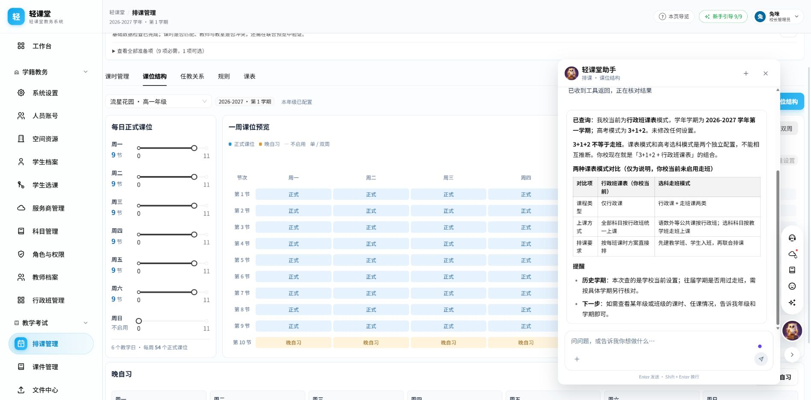
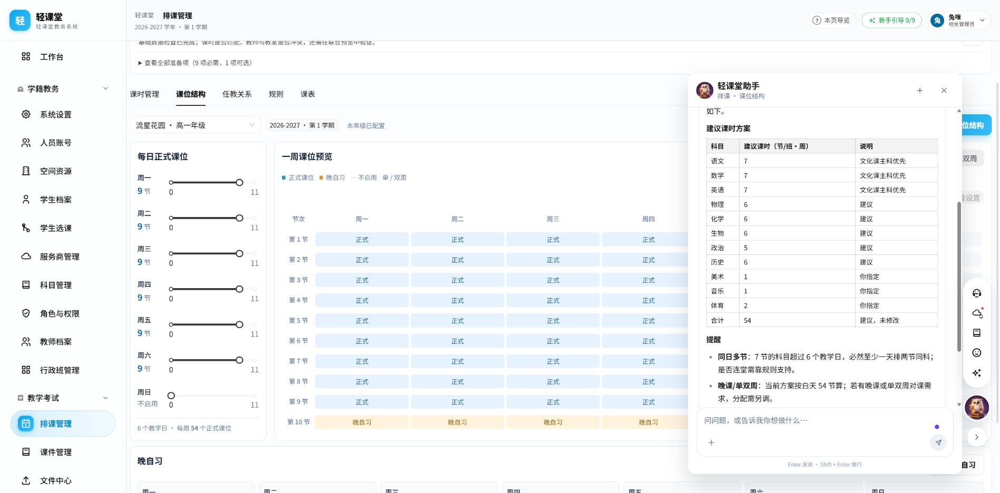

# 教务助手验收（2026-10-08）

## 交付

新增学校环境、学生选科与入班、任课关系、保存课表、基础资源冲突查询。环境先由服务端读取，再结合用户确认的查询范围答复。行政班与选科走班模式区分；走班模式内行政公共课与走班课分别查询或合并查询。数字方案使用带单位的表格，并核对明确可加的课时合计。

详情见 [工具与边界说明](assistant-school-query-tools.md)。

## 自动验证

相关助手、工具循环、路由、消息、课表模式隔离回归共 **212项通过，2项跳过**。SQLite测试覆盖租户权限、学期和历史快照、两种课表模式、两种课程类型、分页、跨年级与跨类型资源冲突、单双周与缺失数据。

全量后端测试曾停滞并中止，未完成。新增文件曾通过Ruff检查；最终环境的虚拟环境没有Ruff模块，最后一次尝试未运行成功。改动文件的 `git diff --check` 通过。

## 真实页面验收

使用已有登录的本地页面 `http://127.0.0.1:5176/scheduling?tab=slots`。当前学校为行政班模式，2026-2027学年第一学期，默认高考模式3+1+2。未切换学校设置、未保存或修改课时、任课关系或课表。

模式回答正确区分“3+1+2”和课表模式，并表格说明行政班与选科走班、走班内两种课程类型。

数字回答渲染为实际HTML表格。语数外各7节，物化生各6节、政治5节、历史6节，美术1节、音乐1节、体育2节，分项合计54节，与页面每周54个白天正式课位一致；标明“建议，未修改”。这是该次问题的建议示例，并非推荐所有学校套用的固定课时。

验收曾发现模型分项与合计不一致，因此补上课时表合计校验与纠正重试；最终页面表格分项与合计一致。同日多节与相邻连堂的区别也已写入提示词。

控制台仅看到原有Ant Design兼容/弃用警告（Spin.tip、Modal.destroyOnClose、Modal.bodyStyle和React19兼容），本次交互未发现新的运行异常。

任课查询实际调用新增工具。验收发现上一轮班级筛选可能被模型带入年级查询，已补充范围与独立字段规则；重测整个高一年级返回130条任课关系，前5条以班级、科目、教师、配置课时、单周节数和双周节数独立列展示，并正确标明还有下一页（next_offset=5）。最终提示词调整后，学校证据、数字校验与工具循环针对性测试再次37项通过。

## 范围限制

冲突工具只核验保存数据中的基础资源时段碰撞；不代表完整排课规则验证或求解可行性。历史学期模式不能由学校当前设置推断。学校级证据查询当前开放给教务管理身份，普通教师与班主任范围授权尚未接入。
